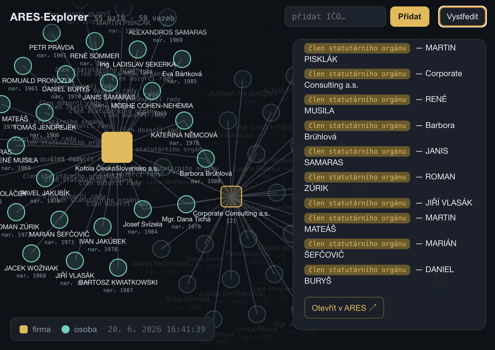
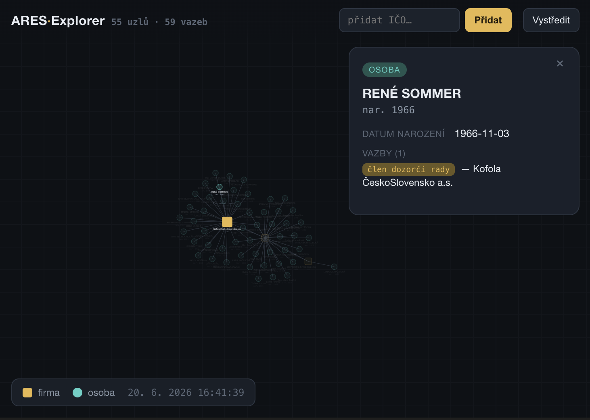

# ARES Explorer 🇨🇿 — MCP App

> **What is this?** An [MCP App](https://modelcontextprotocol.io/extensions/apps/overview) that turns the Czech business register (ARES) into an **interactive relationship graph**. Ask Claude about a company and a force-directed graph of its management and ownership ties renders right in the chat — then **click any company node to expand it live** and watch the network grow. Built with the MCP Apps SDK, a serverless MCP endpoint (`mcp-handler` on Vercel), and D3.

  

---

## How to use it in Claude

> **This is not a website you click on — it's an MCP App connector.** You don't open it in a browser; you add it to Claude as a custom connector and then talk to it in chat.

**Connector endpoint:**

```
https://ares-explorer-mcp.vercel.app/api/mcp
```

Mind the **`/api/mcp`** path — that exact path *is* the MCP endpoint (Streamable HTTP). Opening the URL in a browser shows nothing useful; it's an MCP server, not a web page. The bare domain or any other path won't work as a connector.

**Connect it (one-time):**

1. In **Claude on web or desktop**, go to **Connectors** (now under the **Customize** section — it used to live under **Settings**).
2. Click **Add custom connector**.
3. Paste `https://ares-explorer-mcp.vercel.app/api/mcp` and confirm.

> **Requires a paid Claude plan** (Pro / Max / Team). Custom connectors are not available on the free plan.

> **Harmless sign-in warning.** While adding the connector, Claude may show an OAuth / sign-in message such as *"Couldn't register with sign-in service."* It's safe to ignore — just dismiss it. The server is public and needs no login, and the tools load regardless.

**Try it.** Once connected, ask in chat:

- *„Ukaž graf vazeb firmy s IČO 24130222."* (Show the relationship graph for the company with IČO 24130222.) — then **click company nodes** and the graph grows live.
- *„Vykresli vlastnickou strukturu firmy s IČO 27604977."* (Draw the ownership structure of the company with IČO 27604977.)
- *„Najdi firmu Seznam.cz a ukaž její vazby."* (Find the company Seznam.cz and show its ties.)

---

## What it is

**ARES Explorer** is an MCP App that takes the open data of the Czech [ARES](https://ares.gov.cz) register and builds an **interactive graph of a company's ties** — its statutory body, members/owners, and connected companies — rendering it directly inside Claude. It isn't just a static picture: **company nodes are clickable** and the graph grows live as the app calls back to the server (the "bidirectional loop" of MCP Apps).

Type something like *„Ukaž mi vazby firmy s IČO 24130222."* (Show me the relationships of the company with IČO 24130222.) and you get a canvas where you can explore the ownership and personnel structure by clicking.

### Why it's interesting

- **An MCP App, not just a tool.** Most MCP servers return text. Here a full UI runs in a sandbox and initiates further tool calls on its own based on what the user does. Click a node → `app.callServerTool("expand-node")` → new data is merged into the graph.
- **Real open data.** No mocks — the server talks live to the public ARES REST API.
- **Tolerant parser.** The VR (*veřejný rejstřík*, public register) JSON is deeply nested and varies by legal form. The parser therefore walks the record recursively and pulls out anything that _looks like_ a person (`jmeno` + `prijmeni`) or a connected company (`ico` + `obchodniJmeno`), inferring the role (jednatel, společník, …) from context. Resilient to schema changes.

---

## What it looks like



*The expanded graph (55 nodes · 59 ties). The inspector lists the statutory-body members (člen statutárního orgánu) of the selected company, Corporate Consulting a.s., each with a deep link out to ARES.*



*Click a person node for its detail: René Sommer, born 1966, sits on the supervisory board (člen dozorčí rady) of Kofola ČeskoSlovensko a.s.*

- **Companies** = amber rounded square, **people** = teal circle (distinguished by both shape and color).
- A node with **`+`** can be expanded. The side inspector shows detail, ties, and a link out to ARES.
- The toolbar lets you paste any **IČO** to attach another company to the graph.

---

## Architecture

```
┌──────────────────────────── MCP host (Claude) ────────────────────────────┐
│                                                                            │
│   company-graph(ico)                       sandboxed iframe (ui://)        │
│        │  tool result (GraphData)        ┌──────────────────────────────┐  │
│        ▼  ───────────────────────────▶   │  D3 force graph              │  │
│   ┌─────────────┐                         │  node click ───┐             │  │
│   │  /api/mcp   │ ◀── expand-node(ico) ───│  ◀─────────────┘ callServerTool│
│   │ (serverless)│ ──── GraphData ────────▶│  merge → graph grows         │  │
│   └────┬────────┘                         └──────────────────────────────┘  │
│        │ fetch                                                             │
└────────┼──────────────────────────────────────────────────────────────────┘
         ▼
   ARES REST API  (ares.gov.cz)
   • /ekonomicke-subjekty/{ico}      → base record
   • /ekonomicke-subjekty-vr/{ico}   → public register (ties)
   • /ekonomicke-subjekty/vyhledat   → search by name
```

**Server tools**

| Tool | UI? | What it does |
|------|-----|--------------|
| `ares-search` | no | Najde firmy podle názvu, vrátí IČO. |
| `company-graph` | **yes** | Otevře interaktivní graf vazeb (IČO nebo název). |
| `expand-node` | no | Vrátí podgraf jedné firmy — volá appka při rozkliknutí uzlu. |

> Tool titles and descriptions are intentionally kept in Czech — the app and its data are Czech, so this is how they read to both the user and the model.

The **data contract** (`src/types.ts`) is shared by the server and the UI, keeping both sides in sync. The UI never talks to ARES itself — it only renders `GraphData` and asks the server to expand nodes.

---

## Architecture decision: from Express to serverless

The first version ran as a long-lived Express process exposing the MCP server over Streamable HTTP. It was rewritten as a single Vercel serverless function via `mcp-handler`'s `createMcpHandler` (`app/api/mcp/route.ts`). Streamable HTTP is the recommended MCP transport, so a stateless request/response function maps onto it cleanly — there's no socket to keep alive, and the platform autoscales with load. Vercel's Fluid compute keeps instances warm and reuses them across invocations, avoiding the cold-start lag of sleeping free-tier processes while still scaling down when idle. The one build artifact the function depends on — the app's UI HTML — is inlined into the bundle at build time, so there's no runtime filesystem dependency in the serverless environment.

---

## Tech stack

- **TypeScript** (server and UI), **strict** mode
- [`@modelcontextprotocol/ext-apps`](https://github.com/modelcontextprotocol/ext-apps) — MCP Apps SDK (server helpers + client `App` class)
- [`@modelcontextprotocol/sdk`](https://github.com/modelcontextprotocol/typescript-sdk) — MCP server + Streamable HTTP transport
- [`mcp-handler`](https://github.com/vercel/mcp-handler) + **Next.js 15** App Router — MCP over a single serverless function (`app/api/mcp/route.ts`), no long-lived process. Next.js is used purely as the routing + build wrapper for that one handler — no pages, no `next/*` imports in code. `react` / `react-dom` are pulled in only as Next's required peers, not used by the app (the UI is plain D3 in inlined HTML)
- **zod** — tool input validation
- **D3** (force-directed graph, zoom/pan, drag)
- **Vite** + `vite-plugin-singlefile` — the UI is bundled into one HTML file that the build inlines directly into the serverless function (no external origins → simple CSP)

---

## Local development

You need **Node.js 20+**.

```bash
npm install        # .npmrc sets legacy-peer-deps (see "Deploy to Vercel")
npm run dev        # vite build → inline UI into the function → next dev
```

The MCP endpoint then runs at **`http://localhost:3000/api/mcp`** (Streamable HTTP, POST). As with production, the **`/api/mcp`** path *is* the endpoint — `http://localhost:3000` on its own serves nothing useful (this is an API-only Next.js app).

Other scripts:

```bash
npm run build      # production build: vite + inline + next build
npm run typecheck  # tsc --noEmit
npm test           # unit tests for the ties parser (no network)
```

### The inlined-HTML step

The route handler imports the UI from a **build-generated, gitignored** module — `app/api/mcp/route.ts` does `import { ARES_EXPLORER_HTML } from "./ares-explorer-html"`, and that file (`app/api/mcp/ares-explorer-html.ts`) only exists after the build emits it. Both `npm run dev` and `npm run build` regenerate it for you: they bundle the UI with Vite into `dist/ares-explorer.html`, then `scripts/inline-html.mjs` embeds it as a string into the module. The serverless function therefore has no runtime filesystem dependency — the HTML is part of the bundle.

> **Always start the dev server with `npm run dev`, not a bare `next dev`.** The npm script runs `build:app` + `inline` first; running `next dev` directly on a clean checkout skips those steps and Next will fail to compile on the missing `./ares-explorer-html` import. If you ever hit that, run `npm run dev` (or just `npm run build` once) to generate the module.

### Testing the server without Claude — MCP Inspector

To exercise the endpoint without wiring it into Claude, point the [MCP Inspector](https://github.com/modelcontextprotocol/inspector) at your local server:

```bash
npx @modelcontextprotocol/inspector
```

Connect it to `http://localhost:3000/api/mcp` (transport: Streamable HTTP) and you can drive the protocol directly — `initialize`, `tools/list`, `resources/list` — and call the tools, getting their results back as JSON. This is the fastest way to confirm the server is up and the tools are wired correctly.

> The Inspector only shows **raw JSON** — `company-graph` returns `GraphData`, not the rendered graph. The interactive D3 UI only paints inside an MCP host (Claude), so for the full visual experience use the tunnel flow below.

### Testing the full UI in Claude — via a tunnel

Because the graph renders only inside the MCP host's sandbox, to see the real UI you need to expose your local server over a public URL and add it to Claude as a second custom connector. A quick tunnel:

```bash
cloudflared tunnel --url http://localhost:3000
```

This prints a public `https://<random>.trycloudflare.com` URL. Add **`https://<random>.trycloudflare.com/api/mcp`** as an *additional* custom connector in Claude (same steps as [How to use it in Claude](#how-to-use-it-in-claude), just your tunnel URL) — keep the production connector too — and you can dogfood your local changes with the full clickable graph before opening a PR.

> `cloudflared` is installed separately (e.g. `brew install cloudflared`); there's intentionally no npm script for it, since tunnelling is an ad-hoc debugging step, not part of the build.

For host-free local debugging you can also drive the app with [`basic-host`](https://github.com/modelcontextprotocol/ext-apps/tree/main/examples/basic-host) from the ext-apps repo.

### Recommended workflow

1. **Iterate locally** with `npm run dev` + the MCP Inspector for fast JSON-level checks.
2. **Verify the real UI in Claude** through the cloudflared tunnel once the behaviour looks right.
3. **Open a PR** — only then does it go through CI and review. Production is reached strictly via merge to `main`, as described in [Who can deploy, and how](#who-can-deploy-and-how-contribution-process): PR → CI (typecheck + tests + build) → maintainer review → merge to `main` → production deploy. Nothing ships any other way.

---

## Deploy to Vercel

The project is an API-only **Next.js** app — the only route is the MCP endpoint `app/api/mcp/route.ts`, which serves Streamable HTTP via [`mcp-handler`](https://github.com/vercel/mcp-handler). No long-lived process, no state between requests.

**Via the dashboard:** import the repo at [vercel.com/new](https://vercel.com/new). The framework (Next.js) and build are detected automatically from `vercel.json`; nothing needs to be configured by hand. After deploy, the endpoint lives at `https://<project>.vercel.app/api/mcp`.

**Via the CLI:**

```bash
npm i -g vercel
vercel          # preview deploy
vercel --prod   # production deploy
```

What's wired up for deployment:

- **`vercel.json`** — `framework: nextjs`, `buildCommand: npm run build` (runs vite build → inline HTML → next build), and `maxDuration: 60 s` for the `/api/mcp` function.
- **`.npmrc`** with `legacy-peer-deps=true` — `mcp-handler@1.1.0` pins its `@modelcontextprotocol/sdk` peer to exactly `1.26.0`, whereas `ext-apps` requires `^1.29.0`. The APIs in use (`McpServer` + Streamable HTTP transport) are stable across those versions, so we stay on `1.29.x`. Vercel reads this file at install time too, so the same resolution applies in CI.
- **Inlined HTML** — the app's UI is embedded straight into the function at build time (see above), so the serverless environment never needs to read `dist/` from disk.

After deploying, add `https://<project>.vercel.app/api/mcp` as a custom connector in Claude (see [How to use it in Claude](#how-to-use-it-in-claude)).

### Who can deploy, and how (contribution process)

Production deploys are **gated** — they don't happen on a whim, and not everyone can trigger one.

- **`main` is protected.** No direct pushes for contributors. Every change lands through a pull request that must pass CI (`.github/workflows/ci.yml` → typecheck + tests + build) and get a maintainer's approving review before it can merge.
- **Production = a merge to `main`.** Vercel deploys `main` to production. Since only reviewed, CI-green PRs (or the maintainer's own pushes) reach `main`, nothing ships to production without the maintainer's sign-off.
- **Fork previews are not automatic.** Vercel's Git fork protection is on, so a PR from a fork won't build a preview until a maintainer authorizes it — outside code never builds in this project unprompted.
- **CLI production deploys (`vercel --prod`) are restricted** to the maintainer via Vercel team membership. This is the one path that bypasses GitHub, so team access is kept tight on purpose.

So a new contributor's flow is: **fork → branch → open a PR → CI runs → maintainer reviews and approves → maintainer merges → production deploys.** No task gets to production any other way.

---

## Project structure

```
ares-explorer-mcp/
├── app/
│   └── api/mcp/
│       ├── route.ts            # MCP endpoint: createMcpHandler — tools + UI resource
│       └── ares-explorer-html.ts  # build-generated (gitignored): inlined UI HTML
├── scripts/
│   └── inline-html.mjs         # embeds dist/ares-explorer.html into the function as a string
├── ares-explorer.html          # app entry HTML (inline styles)
├── src/
│   ├── types.ts                # shared data contract (GraphData …)
│   ├── ares.ts                 # ARES REST client + tolerant ties parser
│   └── mcp-app.ts              # UI: D3 force graph, node expansion
├── test/
│   └── graph.test.ts           # parser unit tests (fixtures, no network)
├── vercel.json                 # Vercel: framework, build, maxDuration
├── next.config.mjs
├── vite.config.ts
├── tsconfig.json
└── package.json
```

---

## Notes & limits

- ARES data is **for information only** and has no character of an official document (see the [ARES terms](https://ares.gov.cz)). The API is rate-limited to **500 requests/min**.
- The parser covers the most common forms (s.r.o., a.s., spolek). For exotic structures some ties may be missing — it deliberately omits rather than guesses. The logic is covered by unit tests.
- Subjects with no VR record (e.g. some sole traders / OSVČ) show up as a standalone node with no ties.
- Graph depth is capped (~80 ties per record) to stay readable; deeper levels are filled in by expanding nodes.

## License

MIT — see [`LICENSE`](./LICENSE).

Data: © ARES / Ministry of Finance of the Czech Republic, provided as open data.
